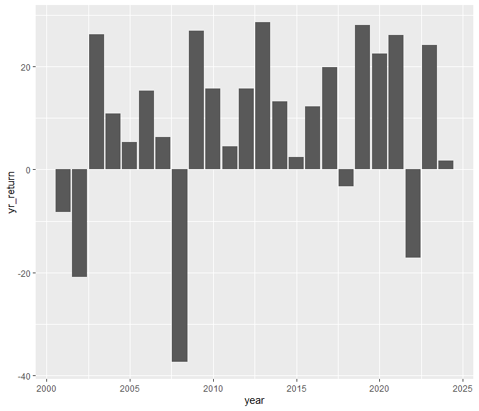

Week 2 Lecture
================
Leo Qi Jie, Justin
2024-01-24

``` r
library(tidyverse)
```

    ## ── Attaching packages ─────────────────────────────────────── tidyverse 1.3.2 ──
    ## ✔ ggplot2 3.4.0      ✔ purrr   1.0.0 
    ## ✔ tibble  3.1.8      ✔ dplyr   1.0.10
    ## ✔ tidyr   1.2.1      ✔ stringr 1.5.0 
    ## ✔ readr   2.1.3      ✔ forcats 0.5.2 
    ## ── Conflicts ────────────────────────────────────────── tidyverse_conflicts() ──
    ## ✖ dplyr::filter() masks stats::filter()
    ## ✖ dplyr::lag()    masks stats::lag()

``` r
library(lubridate)
```

    ## 
    ## Attaching package: 'lubridate'
    ## 
    ## The following objects are masked from 'package:base':
    ## 
    ##     date, intersect, setdiff, union

``` r
stock_df = readRDS("data/wk2_stocks.rds")
str(stock_df)
```

    ## 'data.frame':    5798 obs. of  4 variables:
    ##  $ SPY_prices : num  88.1 87.1 84.3 84.9 84.7 ...
    ##  $ SPY_returns: num  0.04804 -0.01076 -0.03264 0.00774 -0.00264 ...
    ##  $ SPY_vol    : num  88.1 87.1 84.3 84.9 84.7 ...
    ##  $ date       : Date, format: "2001-01-03" "2001-01-04" ...

``` r
#Question 1 The cumulative returns of the S&P index during this period is ________.

sum(stock_df$SPY_returns) * 100
```

    ## [1] 218.3304

The cumulative returns of the S&P index during this period is
218.3303882.

``` r
#Question 2 The average daily returns of the S&P index during this period is ________.

mean(stock_df$SPY_returns)
```

    ## [1] 0.0003765616

The average daily returns of the S&P index during this period is
3.7656155^{-4}.

``` r
#Question 3 The standard deviation of the daily returns of the S&P index during this period is ________.

sd(stock_df$SPY_returns)
```

    ## [1] 0.01221943

The standard deviation of the daily returns of the S&P index during this
period is 0.0122194.

``` r
#Question 4 Create a plot that shows the prices of S&P in this period.

stock_df %>%
  ggplot(aes(x = date, y = SPY_prices)) +
  geom_line()
```

<!-- -->

``` r
# stock_df %>%
#   plot_ly(x = ~date,y = ~SPY_prices,type = "scatter", mode = "lines") 
```

``` r
#Question 5 Create a plot that shows the total yearly returns of S&P from 2001 to 2023.

stock_df %>%
  mutate(year = year(date))%>%
  group_by(year) %>%
  summarize(yr_return = sum(SPY_returns)*100) %>%
  ggplot(aes(x = year, y = yr_return)) +
  geom_col()
```

<!-- -->
